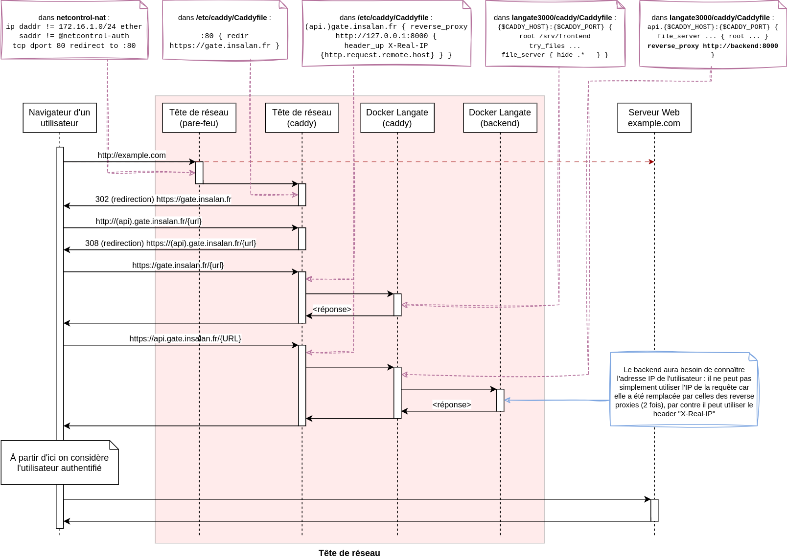

# Reverse Proxy

Le reverse proxy utilisé est [Caddy](https://caddyserver.com/).

Il a deux rôles :
1. Fournir les assets du frontend
  - en mode prod, fournir directement le fichier
  - en mode beta, rediriger les requêtes vers le serveur `vite` (pour avoir le hot reload)
2. Rediriger les requêtes destinées à l'API vers le backend.

## Déploiement

Caddy est automatiquement déployé via le Docker Compose. On utilise l'image Docker par défaut, fournie par Caddy.

### Fichiers nécessaires

Caddy est configuré par un seul fichier de configuration : le _Caddyfile_. Il est dans le dépôt GitHub, ce fichier est monté dans le container.

Il faut également monter les dossiers contenant les assets du frontend et du backend.

Enfin, on monte trois dossiers spécifiques au fonctionnement de Caddy :
- `/var/log/caddy` : pour avoir des logs
- `/config` : pour pouvoir modifier la config en temps réel (moins important)
- `/data` : pour pouvoir conserver des données entre plusieurs lancements (par exemple, des certificats ou du cache)
  - oui, dans notre cas y'a pas de certificats puisqu'on fonctionne uniquement en HTTP (le Caddy externe fournit l'HTTPS) mais bon

### Configuration
Les configurations des sections concernant le [backend](./backend.md) et le [frontend](./frontend.md) sont expliquées en détail dans leurs pages respectives.

Dans le Caddyfile, on a aussi défini une méthode : `server-log`, qui prend 1 argument : le nom du logger. Cette méthode est appelée dans les sections du frontend et du backend et permet de logguer les requêtes dans des fichiers séparés, avec un format facile à lire.

## Schéma
